Text Analysis: State of the Union
================
Aria Huang
2020-12-08

  - [Introduction](#introduction)
  - [Data tidy](#data-tidy)
  - [Exploratory analysis](#exploratory-analysis)
  - [Words networks](#words-networks)
  - [Sentiment analysis](#sentiment-analysis)
      - [Trend of sentiment over time](#trend-of-sentiment-over-time)
      - [Most common sentiment words](#most-common-sentiment-words)
  - [Topic modelling](#topic-modelling)
      - [Most common words](#most-common-words)
      - [Probability of topic](#probability-of-topic)

## Introduction

This study examines the statement of the union for American presidents
until 2016. Donald Trump is not included. This study examines the
overall trends of the speeach, the common words, the sentiment, and
topic modelling. The SOTU contains information about the president name,
the year, text documents, party. Text analysis is an inductive method.

## Data tidy

``` r
sotu<-sotu_meta
# put the text into the column of meta dataset
sotu$text <- sotu_text
```

``` r
x <- "a1~!@#$%^&*(){}_+:\"<>?,./;'[]-=" 

sotu_clean<-sotu %>%
  unnest_tokens ( output = word, input = text) %>%
  #remove numbers
  filter ( !str_detect(word, ' ^[0-9]*')) %>%
  #remove stop words
  anti_join (stop_words) %>%
  # remove stems
  mutate( word = SnowballC::wordStem (word))

#remove special characters from word column
sotu_token <-as.data.frame(gsub("[[:punct:]]", "", as.matrix(sotu_clean))) 
```

    ## <<DocumentTermMatrix (documents: 41, terms: 19384)>>
    ## Non-/sparse entries: 118952/675792
    ## Sparsity           : 85%
    ## Maximal term length: 29
    ## Weighting          : term frequency (tf)

    ## <<DocumentTermMatrix (documents: 41, terms: 7640)>>
    ## Non-/sparse entries: 105292/207948
    ## Sparsity           : 66%
    ## Maximal term length: 16
    ## Weighting          : term frequency (tf)

## Exploratory analysis

``` r
# How the length of the State of the Union has changed over time
sotu_clean %>%
  group_by(year, sotu_type) %>%
  summarize(n = n()) %>%
  ggplot(aes(year, n)) +
    geom_line(color = grey(0.8)) +
    geom_point(aes(color = sotu_type)) +
    geom_smooth(method="loess", formula = y ~ x) +
    theme_minimal()+
    labs( title = "How the length of the State of the Union has changed over time",
          x = "Year",
          y = "Nu,ber of tokens in speeach",
          color= "Document type")
```

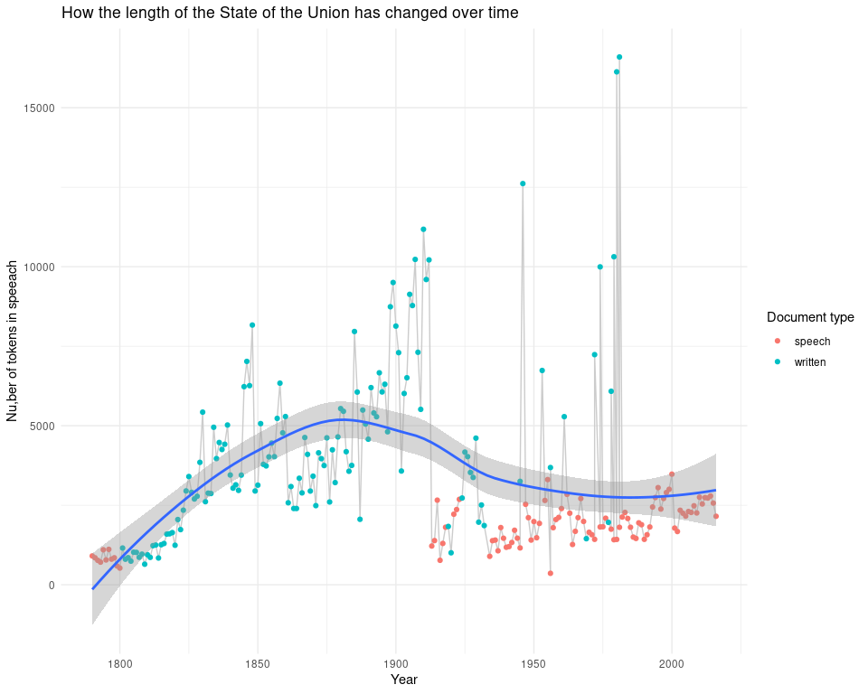<!-- -->

The length of the Statement had increased from 1800 to the 1900, but
declined until 1950, and become steady. The length for speech document
is generally lower than the length of written document.

``` r
# common words

sotu_token %>%
  group_by (word) %>%
  summarize(n = n()) %>%
  arrange(desc(n)) %>%
  slice(1:20) %>%
  ggplot ( mapping = aes ( x = reorder(word, n ), y = n))+
  geom_bar (stat= 'identity')+
  coord_flip()+
  theme_minimal()+
  labs( title = "Most 20 common words in State of the Union",
        x = "",
        y= "Number of occurence")
```

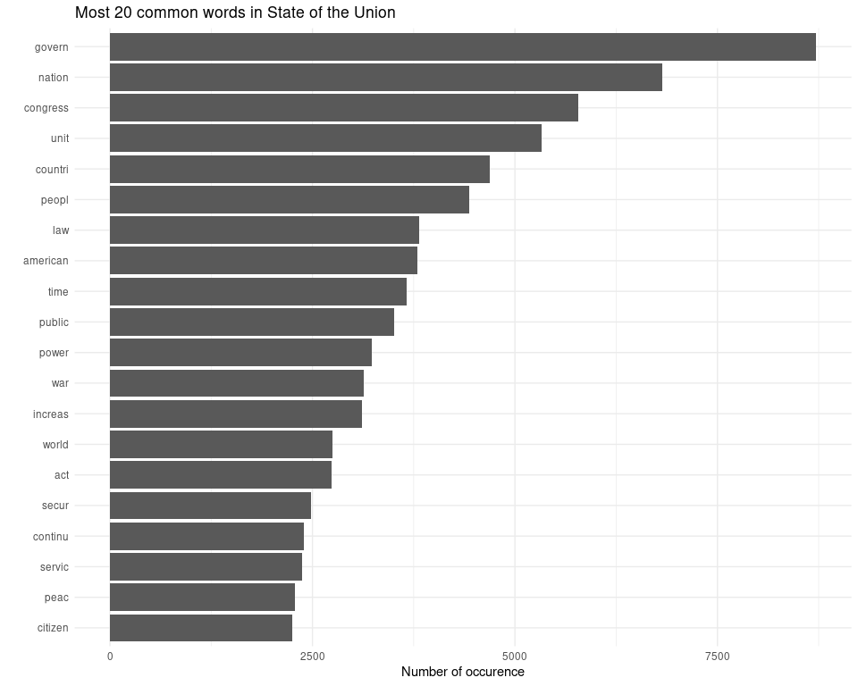<!-- -->

``` r
#word cloud

sotu_token %>%
  count(word) %>%
 with(wordcloud(word, n, max.words = 50))
```

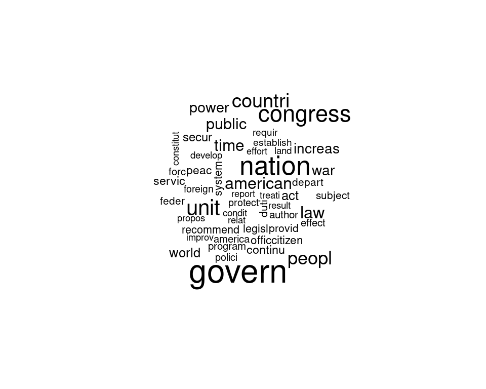<!-- --> These two
graphs show the 50 most common words in the Statement of the Union. As
the cloud graph shows, the most common words in State of the Union is
govern, nation, and congress. The statements are highly political, and
concerned with national building and government. Meanwhile, people,
power, unit, america, and law, are also very common. Populism might be
in trend, as american, people, unite pop out in the common words.

# Words networks

``` r
sotu_bigram <- sotu %>%
  unnest_tokens(bigram, text, token = "ngrams", n = 2)

bigrams_separated <- sotu_bigram %>%
  separate(bigram, c("word1", "word2"), sep = " ")

# filter stop words
bigrams_filtered <- bigrams_separated %>%
  filter(!word1 %in% stop_words$word) %>%
  filter(!word2 %in% stop_words$word)

# new bigram counts:
bigram_counts <- bigrams_filtered %>% 
  count(word1, word2, sort = TRUE)

#occur more than  times
bigram_graph <- bigram_counts %>%
  filter(n > 70) %>%
  graph_from_data_frame()

set.seed(2017)

ggraph(bigram_graph, layout = "fr") +
  geom_edge_link() +
  geom_node_point() +
  geom_node_text(aes(label = name), vjust = 1, hjust = 1)
```

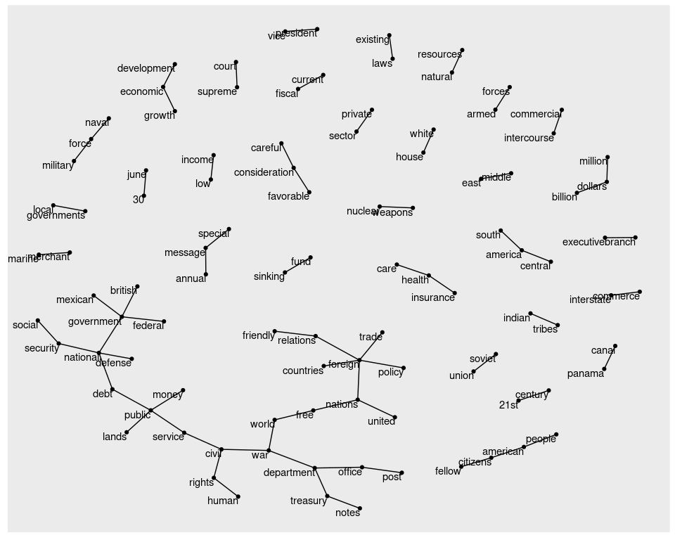<!-- -->

This graph shows the connections between common words in SOTU. There are
one tree family in the networks. Those words are deb, public, money,
human, governemnt, mexican, british, policy, foreign, trade… This
indicates the connectedness of words related to policy, including
foreign policy, financial policy, and property rights etc. Other than
these linked words, other words are lighly connected. They tend to pair,
but not connected to other pairs of words.

``` r
set.seed(2020)

a <- grid::arrow(type = "closed", length = unit(.15, "inches"))

ggraph(bigram_graph, layout = "fr") +
  geom_edge_link(aes(edge_alpha = n), show.legend = FALSE,
                 arrow = a, end_cap = circle(.07, 'inches')) +
  geom_node_point(color = "lightblue", size = 5) +
  geom_node_text(aes(label = name), vjust = 1, hjust = 1) +
  theme_void()
```

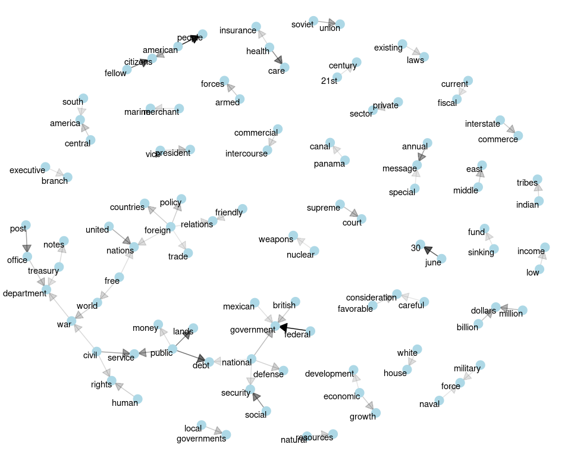<!-- -->

There are some small clustering in this network, such as the clustering
of government, mexican, british, or money, land, and public; or health,
insurance, care. These clusterings indicate social issues like global
policy, proprety rights, and healthcare. However most words in the
network are disconnected, indicating that the SOTU dataset keywords are
not organized into families of words that tend to go together.

``` r
#What is tf-idf for the description field words
sotu_tf_idf <- sotu_token %>% 
  count(president, word, sort = TRUE) %>%
  ungroup() %>%
  bind_tf_idf(word, president, n)
```

``` r
sotu_tf_idf %>%
  arrange (-tf_idf) %>%
  slice(1:10) %>%
  ggplot( aes (x =reorder(word, tf_idf), y = tf_idf, fill = president))+
  geom_bar(stat= 'identity')+
  coord_flip()+
  theme_light()+
  labs( title = "Most important words for some presidents",
        x = NULL,
        fill = 'President')
```

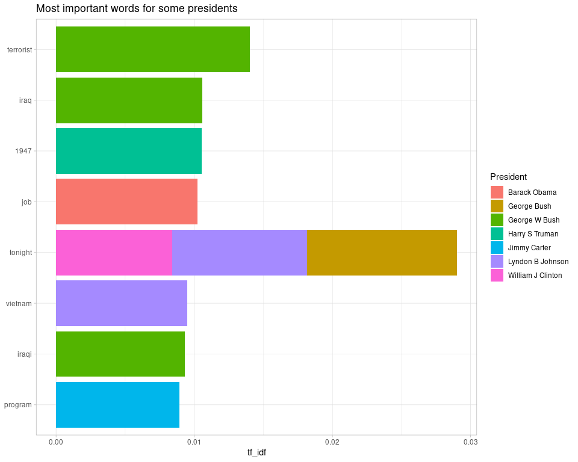<!-- -->

These are the most important words in for president as measured by
tf-idf, meaning they are common but not too common. Terrorist and Irap
are the most important words for George W Bush, indicating the Iraq war.
Tonight is very important to Clinton, Johnson, ad George Bush, while it
remains in question: what does tognight imply?. Job is very important
for Obabma, showing his concern on job market, employment. These words
show that presidents concern a lot about war, as indicated by 1947,
vietnam, iraq, war.

``` r
sotu_tf_idf_join <- full_join(sotu_tf_idf, sotu, by ='president')

sotu_tf_idf_join %>%
  filter(party != 'NA',
         # no numbers
         !str_detect(word, "(\\s+[A-Za-z]+)?[0-9-]+")) %>%
  # no stop words
  anti_join (stop_words) %>%
  filter(!near(tf, 1)) %>%
  arrange(desc(tf_idf)) %>%
  # by party
  group_by (party) %>%
  distinct(word, party, .keep_all = TRUE) %>%
  slice_max ( tf_idf, n= 15, with_ties = FALSE) %>%
  ungroup() %>%
   mutate(word = factor(word, levels = rev(unique(word)))) %>%
  ggplot(aes(tf_idf, word, fill = party)) +
  geom_col(show.legend = FALSE) +
  facet_wrap(~party, scales = "free") +
  labs(title = "Highest tf-idf words in SOTU by partisanship",
       x = "tf-idf", 
       y = NULL)
```

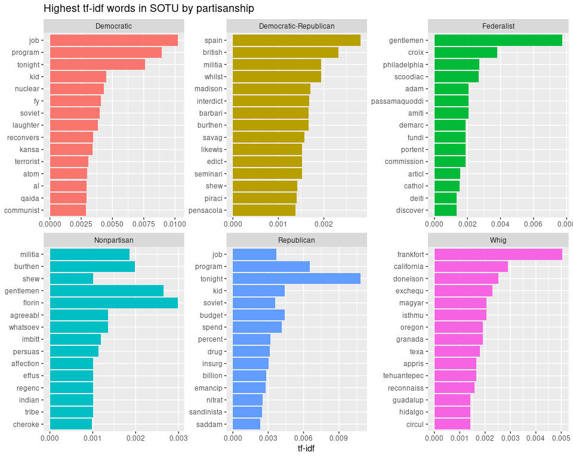<!-- -->

Democrats value about job, program, soviet, nuclear, atom, communist.
Democrats concern more about employment program and national security,
and ideological construction (against communism). Republicans also
concern about job program, soviet, having some similarities to
democrats. But Republicans also value about budget, spend, percent,
indicating their concern about monetary or financial plans. The valued
words in other partisanship do not imply strong topics and clusterings.

# Sentiment analysis

``` r
#sentiment
sotu_sentiment <- sotu_token %>%
  inner_join(get_sentiments())
```

``` r
# sentiment by president

sotu_sentiment %>%
  #reorder according to year
  mutate(president = fct_reorder(president, as.numeric(year))) %>%
  group_by (president, sentiment) %>%
  summarize(n = n()) %>%
  ggplot(aes ( x = sentiment, 
               y = n, 
               fill = sentiment))+
  geom_bar(stat= 'identity')+
  facet_wrap(.~ president, 
             ncol = 5) +
  theme(legend.position="none")+
  labs( title = "Sentiment in State of the Union by president",
        x = NULL,
        fill = "Sentiment")+
  theme_minimal()
```

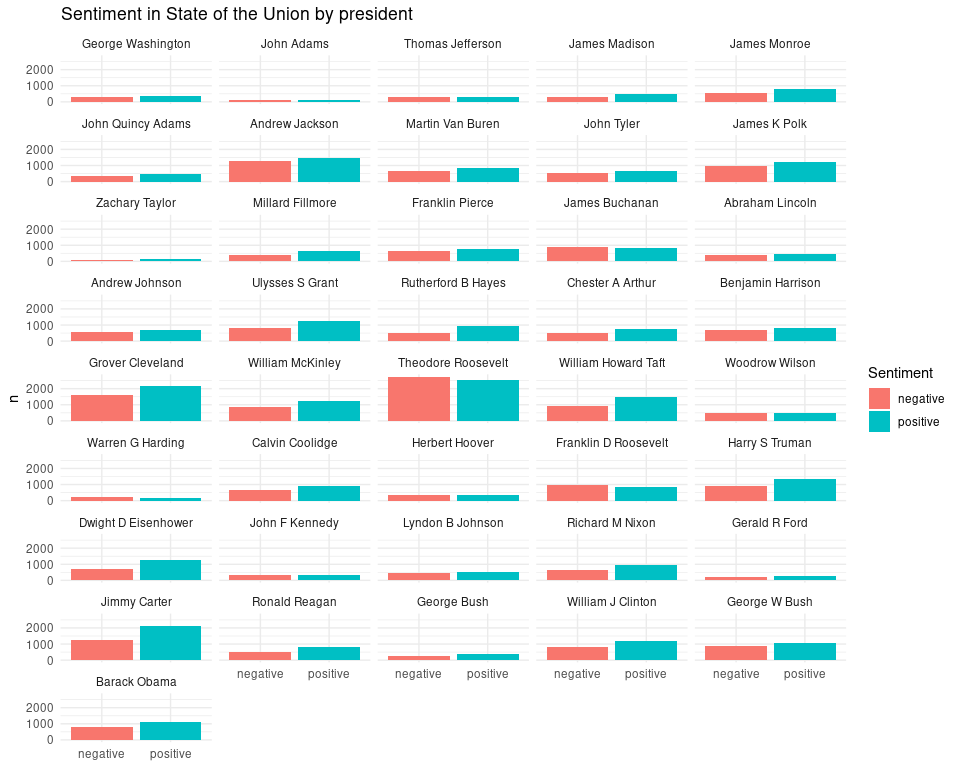<!-- -->

Most presidents have more positive sentiments than negative, except for
Roose. This indicates that presidents tend to showcase their
positiveness toward future in their statements.

## Trend of sentiment over time

``` r
sotu_sentiment %>%
  group_by(president) %>%
  count(year, sentiment) %>%
  spread(sentiment, n, fill = 0) %>%
  mutate(sentiment = positive - negative)%>%
  ggplot ( aes (x = as.numeric(year), y  = sentiment, fill = fct_reorder(president, as.numeric(year))))+
  geom_col()+
  scale_x_continuous(breaks = seq(from = 1790, to = 2019, by = 8),
                     #ajust the x asix
                     guide = guide_axis(n.dodge = 2))+
  theme_light()+
  theme(legend.position = 'bottom')+
  labs( title = "Trend of Sentiment",
        x = NULL,
        y = "Sentiment index", 
        fill = "")
```

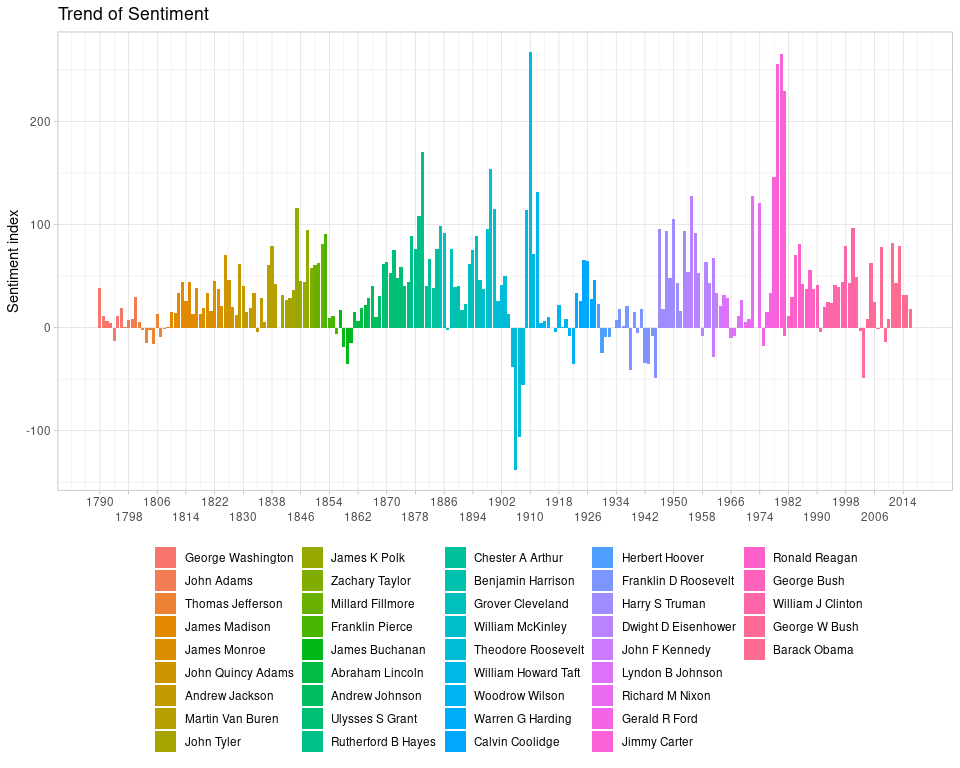<!-- --> This graph
shows the trend of sentiment. Overall, the sentiment tends to be
positive, except for from 1918-1942, the sentiments were generally
negative. This is due to the WWI, the great depression, and the WWII.
Sentiments of the statements are highly connected to the political
contexts. After Roosevelt, when Truman was the president, the sentiment
returned to positive. In 1980s, the sentiment reached a peak again,
which might be due to Regan’s presidency and the increasing modern
conservatism. George W. Bush’s sentiment is also negative, which might
be influenced by the Iraq War. Overall, the sentiment is associated with
the global political context and domestic economic conditions.

## Most common sentiment words

``` r
# most common sentiment words
 word_count <- sotu_sentiment %>%
  count(word, sentiment, sort = TRUE) %>%
  ungroup()

word_count %>%
  group_by (sentiment) %>%
  top_n(10) %>%
  ungroup()  %>%
  mutate(word = reorder(word, n)) %>%
  ggplot(aes(n, word, fill = sentiment)) +
  geom_col(show.legend = FALSE) +
  facet_wrap(~sentiment, scales = "free_y") +
  labs(x = "Contribution to sentiment",
       y = NULL)
```

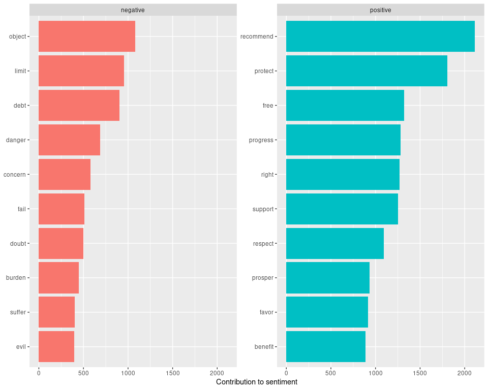<!-- -->

The “object” is the word that contribute mostly to the negative
sentiment, followed by “limit”, “debt”, “danger”. Recommend" is the word
that contribute most to positive sentiment word, followed by “protect”
and “free”. Negative sentiment is more connected to narratives like debt
limit, financial issue. Positive sentiment is more related to rights,
environmental-friendly consciousness, and future plan.

``` r
sotu_sentiment %>%
  count(word, sentiment, sort = TRUE) %>%
  acast(word ~ sentiment, value.var = "n", fill = 0) %>%
  comparison.cloud(colors = c("grey20", "grey80"),
                   max.words = 100)
```

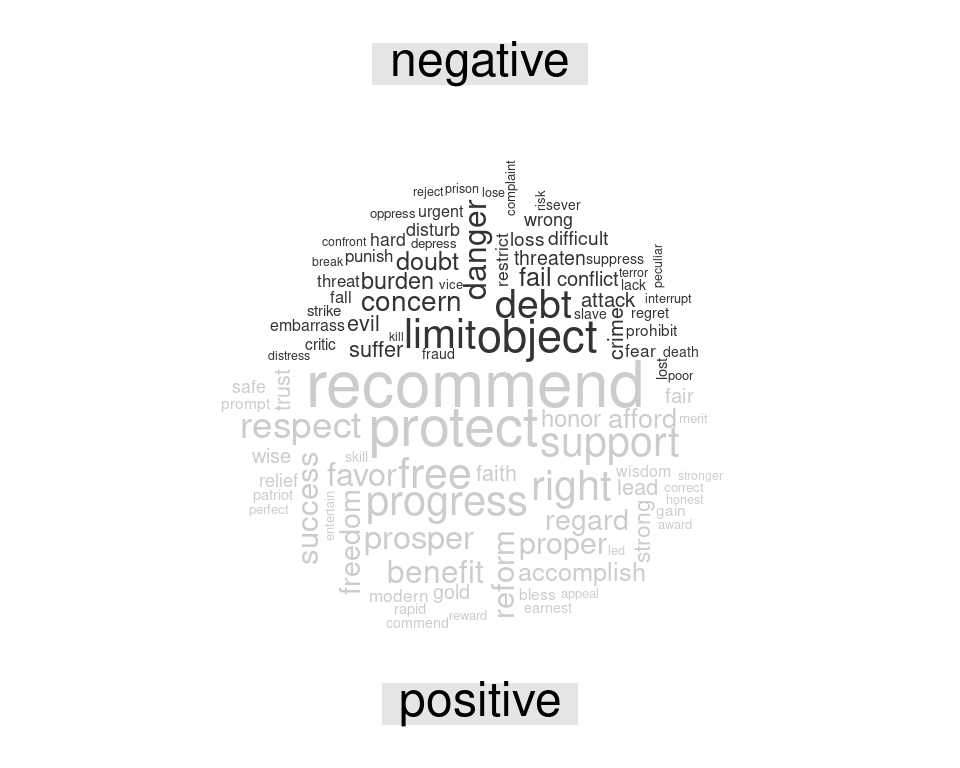<!-- -->

# Topic modelling

``` r
#topic 
sotu_lda<-LDA(sotu_dtm, k =2, control = list(seed = 123))
sotu_topic<- tidy(sotu_lda, matrix = 'beta')
```

## Most common words

``` r
# find the 10 terms that are most common within each topic. 
sotu_top_terms <- sotu_topic %>%
  group_by(topic) %>%
  top_n(10, beta) %>%
  ungroup() %>%
  arrange( topic, -beta) 
  
sotu_top_terms %>%
  mutate(term = reorder_within(term, beta, topic)) %>%
  ggplot(aes(beta, term, fill = factor(topic))) +
  geom_col(show.legend = FALSE) +
  facet_wrap(~ topic, scales = "free") +
  scale_y_reordered()
```

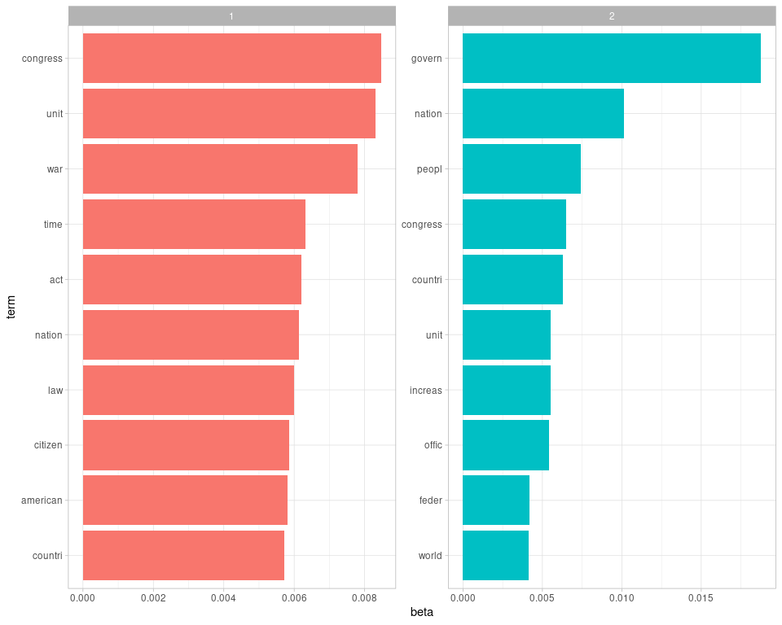<!-- --> This graph
shows the most common words for each topic. For topic 1, congress, unit,
war, time, act, law are popular words. This topic might be related to
military policy or domination or external policy like diplomacy. For
topic 2, most common words are govern, nation, people, congress. Topic 2
might be more related to internal policy. Particularly it might be
related to populism.

``` r
# The words with the greatest differences between topics
beta_spread <- sotu_topic %>%
  mutate(topic = paste0("topic", topic)) %>%
  spread(topic, beta) %>%
  filter(topic1 > .001 | topic2 > .001) %>%
  mutate(log_ratio = log2(topic2 / topic1))

#plot
beta_spread %>%
  arrange(desc(abs(log_ratio))) %>%
  slice(1:20) %>%
  ggplot( mapping = aes (y = log_ratio, x = reorder(term, log_ratio)))+
  geom_bar(stat= 'identity')+
  coord_flip()+
  theme_light()+
  labs ( title = "The words with the greatest differences between the two topics",
         x = NULL,
         y ="Log ratio")
```

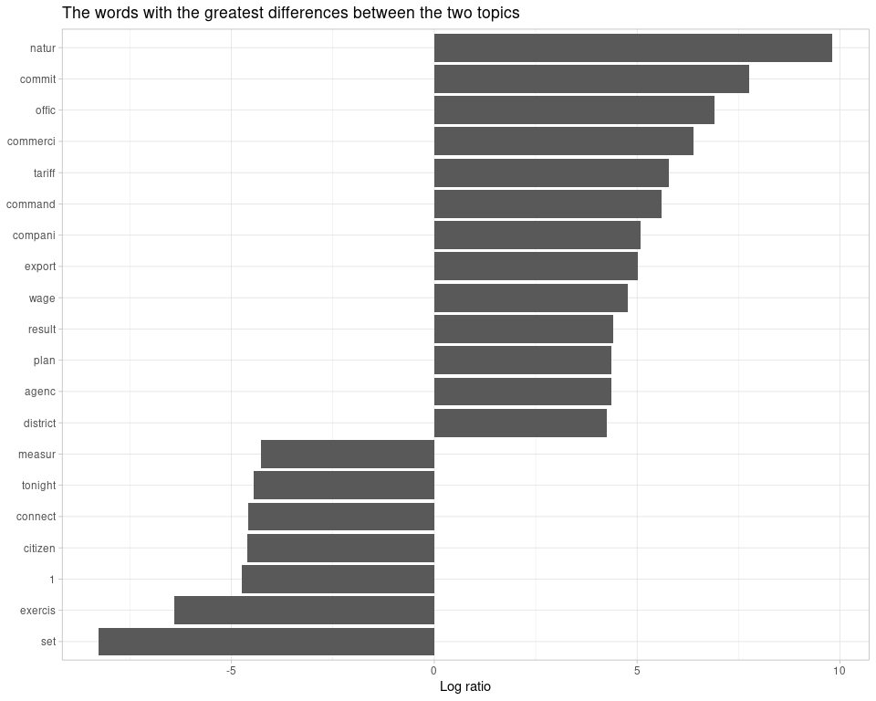<!-- -->

This graph shows the words with greatest differences between two topics.
Nature, commit, office, commercial, set, exercise, citizen, connect are
words that differ a lot between two topics. Compared to topic 1, topic 2
does not focus much on natural stuffs, such as environmental policy, it
does not concern much about commitment or free market (indicated by
commercial and tariff).

## Probability of topic

We just explored each workd are associated with which topics and which
words have the greatest difference between two topics. Next, let’s
examine which topics are associated with which description fields (i.e.,
documents)

``` r
# document topic prob
#Each of these values is an estimated proportion of words from that document that are generated from that topic. 
sotu_gamma <- tidy(sotu_lda, matrix = "gamma")

# 55% of the Lincoln's statement comes from topic 1

sotu_gamma
```

    ## # A tibble: 82 x 3
    ##    document              topic gamma
    ##    <chr>                 <int> <dbl>
    ##  1 Abraham Lincoln           1 0.551
    ##  2 Andrew Jackson            1 0.524
    ##  3 Andrew Johnson            1 0.493
    ##  4 Barack Obama              1 0.378
    ##  5 Benjamin Harrison         1 0.442
    ##  6 Calvin Coolidge           1 0.435
    ##  7 Chester A. Arthur         1 0.454
    ##  8 Dwight D. Eisenhower      1 0.415
    ##  9 Franklin D. Roosevelt     1 0.498
    ## 10 Franklin Pierce           1 0.560
    ## # … with 72 more rows

The gamma indicates the probability of the statement comes from topic 1.

``` r
# plot the gamma
sotu_gamma %>%
  mutate(title = reorder(document, gamma * topic)) %>%
  ggplot(aes(factor(topic), gamma, color = factor(topic))) +
  geom_boxplot() +
  facet_wrap(~ document, ncol= 5) +
  labs(x = "topic", y = expression(gamma))
```

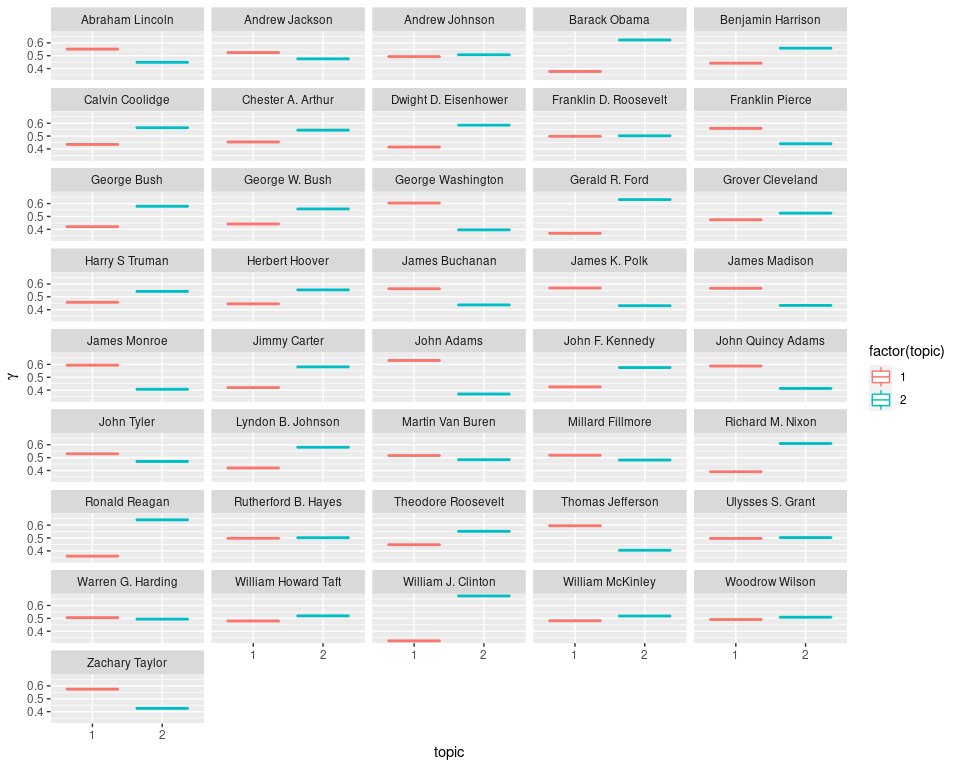<!-- -->

``` r
#How are the probabilities distributed?
sotu_gamma %>%
ggplot(aes(gamma)) +
  geom_histogram(alpha = 0.8) +
  labs(title = "Distribution of probabilities for all topics",
       y = "Number of documents", x = expression(gamma))+
  theme_minimal()
```

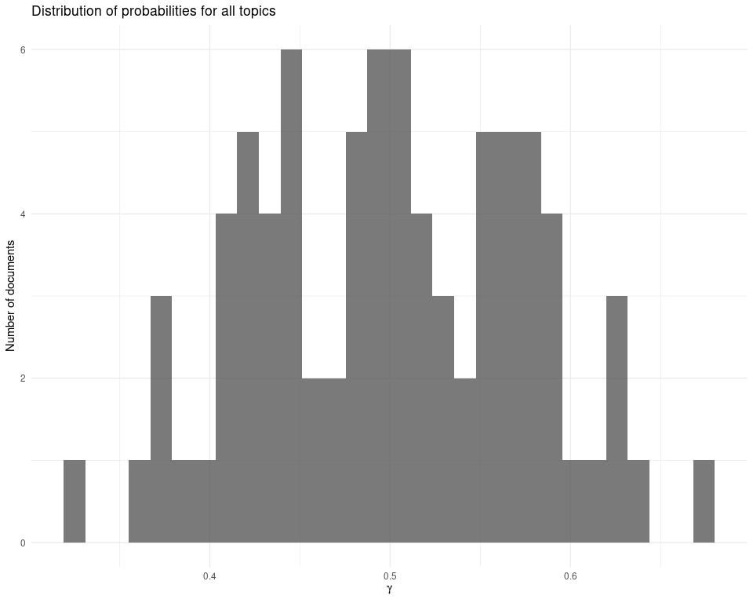<!-- --> Values near 1
indicate the documents that do belong in those topics, values near 0
indicate documents that do not belong in each topic. This distribution
shows that the probability of belonging to a topic is pretty even, as
most values concentrate in 0.4 to 0.6. We can look at how the
probabilities are distributed within each topic.

``` r
ggplot (data = sotu_gamma, 
        mapping = aes ( x = gamma, fill = as.factor(topic)))+
  geom_histogram()+
  facet_wrap(~ topic)+
   labs(title = "Distribution of probability for each topic",
       y = "Number of documents", x = expression(gamma))+
  theme_minimal()
```

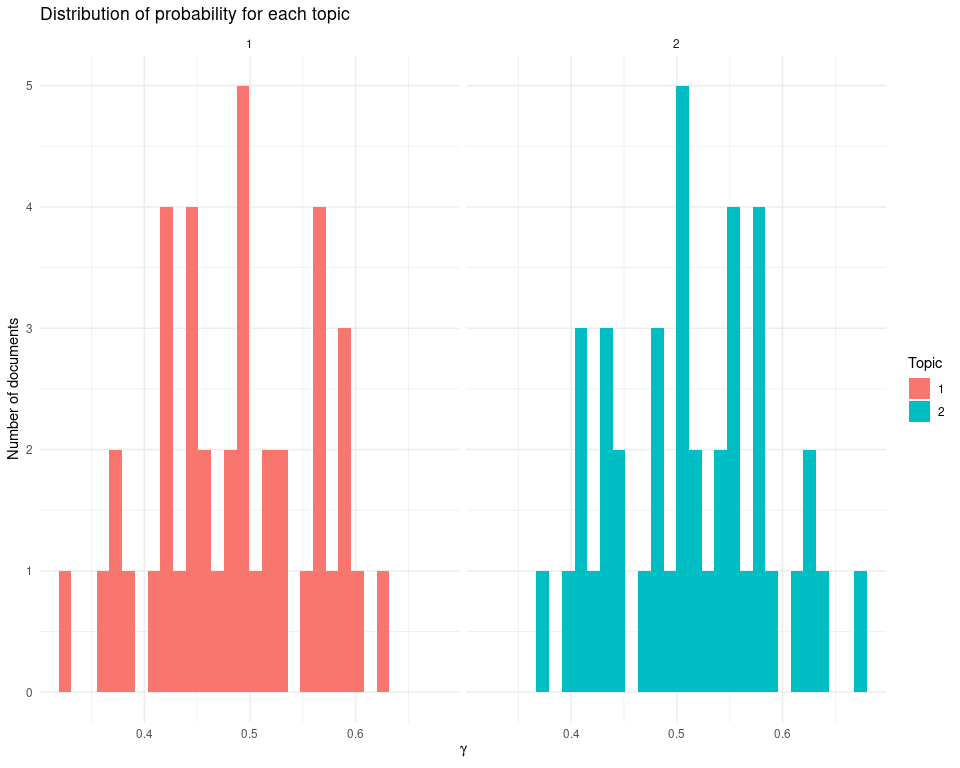<!-- -->

Both topic 1 and topic 2 have similar distribution of the probability.
However, values are more leaning towards 1 for topics 2, indicating that
topic 2 have more documents belong to the topic.

\`\`\`
